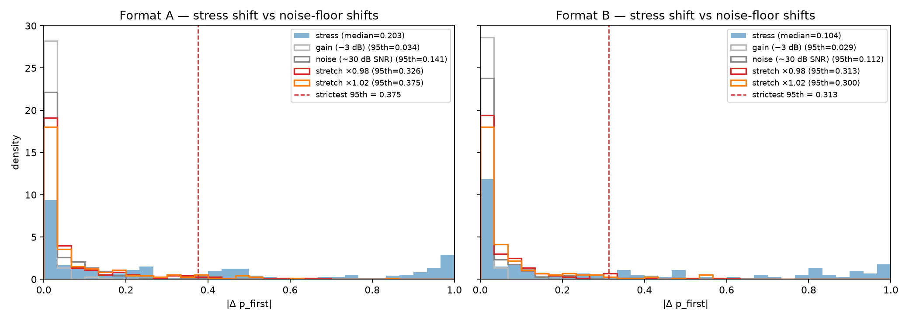
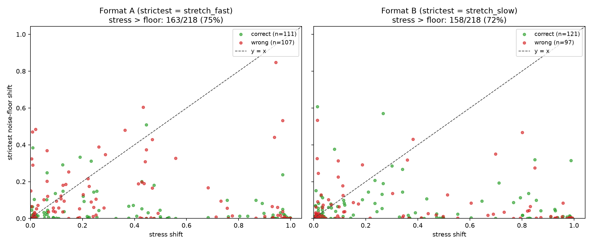
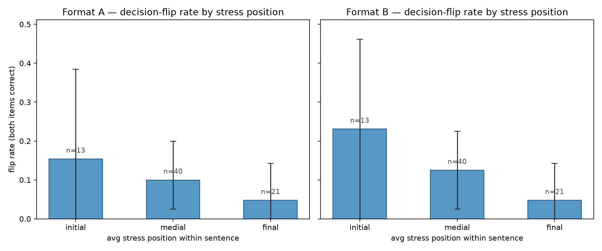

# Sub-Decision Prosodic Sensitivity in Qwen2-Audio-7B-Instruct

*A diagnostic study using StressTest contrastive-stress items*

---

## Abstract

When a speech-LLM picks the wrong final answer on a contrastive-stress
question, two very different things might be happening: its audio encoder
might be discarding prosody (ears), or its language backbone might be
receiving the signal but underweighting it (brain). The standard accuracy
metric collapses both into a single "wrong." This study reads
Qwen2-Audio-7B-Instruct's sub-decision logits — the raw probabilities
behind its top-1 answer — on the 218 items of the StressTest benchmark, and
shows that the model's internal distribution **does** shift in response to
acoustic stress (paired Wilcoxon p ≈ 10⁻¹⁸ in Format A, 10⁻¹⁷ in Format B),
even when the final answer is wrong. A text-rescue probe that feeds the
*same language-model backbone* the transcript with the stressed word in
ALL CAPS lifts accuracy to ~59% — beating the primary audio model on both
argmax (51–56%) and pair-consistency (14–20%) metrics. The bottleneck is
in the audio→LM interface, not in the language model. A pre-registered
"stress median > 95th percentile of strictest floor" check failed, but for
a documented reason: Qwen2-Audio is unusually fragile to ±2% time-stretch
perturbations, so the strictest floor is wider than the threshold assumed.
We report this transparently as a secondary finding about the model rather
than tune the bar to pass.

---

## 1. Introduction

Speech-LLMs are increasingly deployed in voice assistants, transcription
pipelines, and accessibility software. Prior work — most notably the
StressTest benchmark (HUJI 2025) — has shown that these models often pick
the wrong answer when meaning hinges on which word the speaker stresses.
But a wrong final answer is a coarse signal. It could mean the model is
truly deaf to prosody (its internal probabilities don't move at all when
stress changes), or it could mean the model is partially sensitive (the
probabilities shift in the correct direction, just not enough to flip the
top choice). These two failure modes call for different engineering
responses: the first implicates the audio encoder, the second implicates
the language backbone or the audio→LM interface.

This project distinguishes them by reading the model's hidden probability
distribution instead of just its top-1 answer, and complements that
measurement with a text-rescue probe that isolates the language model from
the audio pathway. The whole study is **inference-only** — no training,
no fine-tuning, a single 16 GB GPU.

The research question, in one sentence: *when Qwen2-Audio-7B-Instruct gets
a contrastive-stress item wrong, does the acoustic stress still shift the
output distribution beneath the final answer, and if so, where in the
architecture is the signal being lost?*

---

## 2. Methods

### 2.1 Model and benchmark

- **Primary model.** Qwen2-Audio-7B-Instruct, loaded in 4-bit NF4
  quantization via bitsandbytes. Inference on a single Google Colab T4
  (16 GB VRAM).
- **Language-only backbone.** Qwen2-7B-Instruct (same parameter count and
  tokenizer family as Qwen2-Audio's text decoder), used for the text-only,
  cascade, and text-rescue pathways.
- **Transcription model for the cascade pathway.** Whisper-large-v3.
- **Benchmark.** StressTest (`slprl/StressTest` on HuggingFace), 218
  audio items spanning 101 sentences with 2–3 contrastive stress patterns
  each. Each item gives an audio clip, a gold transcript, a `possible_answers`
  pair, a binary label, and a `stress_pattern` dict marking the stressed
  word(s) by index. License CC-BY-NC-4.0, suitable for academic work.

### 2.2 Logit-extraction strategy

Rather than letting the model generate a free-form answer, we halt after
the *very first* generated token and read the raw logits for the two
competing answer tokens. A two-way softmax over those two logits gives a
clean probability for each candidate. This preserves the sub-decision
distribution that argmax decoding discards, and constrains the analysis
to a well-defined "P(A | A or B)" rather than a vocabulary-wide softmax.

Two answer formats were run to guard against single-format artifacts:

- **Format A.** Options labeled `A.` / `B.`; next predicted token is
  ` A` (id 362) or ` B` (id 425).
- **Format B.** Options labeled `1.` / `2.`; next predicted token is
  `1` (id 16) or `2` (id 17). Format B's prompt ends with a trailing
  space so the space is absorbed into the prompt rather than the answer
  token (` 1` and ` 2` are two tokens on this tokenizer).

Token IDs were empirically verified once on the Qwen2 tokenizer
(`scripts/verify_tokens.py`) and hard-coded thereafter. An independent
`model.generate()` argmax-vs-extracted-logit-argmax sanity check on a
sampled subset prevents off-by-one position errors and tokenizer drift.

### 2.3 Pathways

Five extraction pathways were run, each producing one JSONL record per
item per format (`results/logits_*.jsonl`):

| Pathway | Input to the LM | Purpose |
|---|---|---|
| Primary | Qwen2-Audio sees raw audio | The thing being measured |
| Text-only | Qwen2-7B sees the gold transcript | Falsification: is the answer in the text? |
| Cascade | Whisper → Qwen2-7B | Falsification: does ASR + LM solve it? |
| Text-rescue | Qwen2-7B sees transcript with the stressed word in ALL CAPS | Architectural probe: ears vs brain |
| Noise floor | Qwen2-Audio sees a meaning-preserving perturbation of the audio | Sub-decision baseline wobble |

The noise floor uses four perturbations applied to the original audio:
gain (−3 dB), additive Gaussian noise (~30 dB SNR), time-stretch ×0.98
(slow) and ×1.02 (fast). Perturbation seeds are deterministic per-item.

The text-rescue hint format is locked at ALL-CAPS-on-stressed-word
(e.g. `"I didn't say HE stole the money."`). This convention matches the
StressTest paper's own usage and avoids leaking semantic framing through
annotation wording. Word indices come straight from the dataset's
`stress_pattern["indices"]` field, so the capitalized word is exactly the
prosodically-stressed one and nothing else.

### 2.4 Metrics and statistics

Per item we compute the stress-induced shift
`|p_first(item) − p_first(sister)|`, averaged over sisters when a
sentence has more than two stress patterns. The corresponding noise-floor
shift for perturbation *p* is `|p_first(clean) − p_first(perturbed_p)|`.

Two headline tests, one per answer format:

- **Headline 1 — decision-flip rate.** For pairs whose two members have
  *different* gold labels (n = 74 eligible pairs), what fraction flips
  the model's argmax in the correct direction (each member lands on its
  own label)? Reported with bootstrap 95% CIs over the indicator array.
- **Headline 2 — paired Wilcoxon, stress shift vs strictest floor.** The
  "strictest" perturbation is the one with the largest 95th-percentile
  shift; we use a one-sided test of "stress shift > floor shift" on the
  per-item paired values.

A pre-registered threshold check sits on top of Headline 2: the median
stress shift must exceed the 95th percentile of the strictest floor's
distribution. This is a strictly stronger bar than the Wilcoxon and was
committed to in `CLAUDE.md` before the analysis was run.

All bootstrap CIs use 10 000 resamples and a fixed seed (`20260615`).
Code and intermediate JSONLs are all in the repository — see §7.

---

## 3. Results

### 3.1 Pathway accuracies

Argmax accuracy (left) and pair-consistency accuracy (right; both items
of a contrastive pair correct):

| Pathway | A argmax | B argmax | A pair-both | B pair-both |
|---|---|---|---|---|
| Primary (Qwen2-Audio) | 50.9% | 55.5% | 13.5% | 19.5% |
| Text-only (gold transcript) | 49.5% | 48.2% | 8.3% | 8.3% |
| Cascade (Whisper → LM) | 49.5% | 48.2% | 8.3% | 8.3% |
| **Text-rescue (ALL-CAPS hint)** | **59.6%** | **59.2%** | **23.3%** | **22.6%** |

Two falsification controls sit at chance: lexical content alone is not
enough to solve StressTest. Whisper transcribes these short clean clips
accurately enough that the cascade collapses to the text-only condition
(identical to three decimal places). The primary audio model is a couple
of points above chance on argmax — consistent with the StressTest paper —
and noticeably better on pair-consistency, which can't be gamed by single-
item heuristics like option-order bias.

The text-rescue row is the first piece of the architectural-attribution
story; we return to it in §3.5.

### 3.2 Headline 1 — decision-flip rate

Of the 74 within-sentence pairs whose two items carry *different* gold
labels, how often does the model's argmax flip in the correct direction?

| Format | Flip rate | Bootstrap 95% CI |
|---|---|---|
| A | 9.5% | (4.1%, 16.2%) |
| B | 12.2% | (5.4%, 20.3%) |

Both CIs exclude zero. The flip rate is modest but reliably non-zero —
the model flips its answer in the correct direction about one pair in
ten. (A chance baseline would be a quarter — independent-coin-flip
agreement on a pair of binary choices.)

### 3.3 Headline 2 — stress shift vs noise-floor shift

Paired one-sided Wilcoxon tests of "stress shift > strictest-floor shift"
on the 218 per-item paired observations:

| Format | Strictest floor | + / − / = | Median Δ | 95% CI on median Δ | Wilcoxon p |
|---|---|---|---|---|---|
| A | stretch_fast | 163 / 55 / 0 | 0.082 | (0.031, 0.147) | 4.2 × 10⁻¹⁸ |
| B | stretch_slow | 158 / 60 / 0 | 0.034 | (0.009, 0.081) | 7.7 × 10⁻¹⁷ |

In both formats, ~72–75% of items show a larger stress shift than the
strictest noise-floor shift. The paired-difference median is positive in
every bootstrap resample. The sub-decision logits respond more to stress
than to acoustic perturbation, per item, with extremely high confidence.

*Figure 1. Per-format histogram of the stress-shift distribution (filled
blue) overlaid with the four noise-floor distributions (step outlines).
The dashed vertical line marks the 95th percentile of the strictest
perturbation — this is the pre-registered threshold (see §3.6). Stress
has substantial mass past 0.4 where the floors do not, but its median
sits below the strictest-floor 95th percentile.*

*Figure 2. Per-item scatter of stress shift (x) against strictest noise-
floor shift (y), with a y = x diagonal. Points below the diagonal have
stress > floor; 163/218 = 75% of Format A points and 158/218 = 72% of
Format B points fall there. Color indicates whether the primary audio
model got that item correct; correct and wrong points are roughly
symmetrically distributed around the diagonal, which matches the project
hypothesis — stress moves the logits whether or not the final answer
ends up correct.*

### 3.4 Decision-flip rate by stress position

Breaking the flip rate down by average sentence-stress position (initial
/ medial / final third of the sentence) gives a suggestive but
under-powered pattern:

*Figure 3. Decision-flip rate (both items of a label-differing pair
correct) binned by the average word-fraction position of the two
members' stressed words. Initial-stress pairs flip at 15% / 23% (A / B),
medial at 10% / 13%, final at 5% / 5%. Error bars are 95% bootstrap CIs.
With n = 13 / 40 / 21 pairs the CIs are wide and overlap heavily; the
downward trend is consistent in both formats but not load-bearing.*

If the pattern survives a larger sample it would suggest the model uses
sentence-initial stress more than sentence-final stress, consistent with
attention-decay accounts of the audio encoder. We do not stake the
project's conclusions on this figure.

### 3.5 Architectural attribution: ears, not brain

The text-rescue probe re-runs the contrastive-stress task on the *same*
language-model backbone used in the text-only and cascade pathways
(Qwen2-7B-Instruct), but with the stressed word capitalized in the
transcript. Comparing the four LM-backbone conditions to the primary
audio model:

| Backbone / input | A argmax | B argmax | A pair-both | B pair-both |
|---|---|---|---|---|
| Qwen2-7B, gold transcript (no hint) | 49.5% | 48.2% | 8.3% | 8.3% |
| Qwen2-7B, Whisper transcript (no hint) | 49.5% | 48.2% | 8.3% | 8.3% |
| Qwen2-7B, gold transcript + ALL-CAPS hint | **59.6%** | **59.2%** | **23.3%** | **22.6%** |
| Qwen2-Audio, raw audio | 50.9% | 55.5% | 13.5% | 19.5% |

Three observations:

1. **The LM backbone can use stress.** When stress arrives as a lexical
   cue (one word in caps), the same backbone that sat at chance on plain
   transcripts jumps ~10 points on argmax and roughly doubles pair-
   consistency.
2. **Text-rescue exceeds the primary audio model on both metrics, in
   both formats.** A trivial lexical encoding of stress is more useful
   to the downstream LM than whatever signal Qwen2-Audio currently
   extracts from the acoustic waveform.
3. **The bottleneck is perceptual, not integrative.** The audio model is
   not deaf to stress — the sub-decision Wilcoxon in §3.3 shows the
   logits respond — but it is not routing that signal cleanly into the
   part of the representation the LM head reads from. "Ears failed" is
   shorthand for: stress reaches the audio embedding only weakly, and
   the bridge between audio encoder and language head loses most of it.

This narrows the design space for any follow-up: improvements should
target the audio→LM interface (e.g. richer prosodic features routed to
the text decoder, or training the bridge with stress-contrastive
objectives), not the language model itself.

### 3.6 The pre-registered threshold that failed

The pre-registration committed to a stricter bar than the Wilcoxon: the
median stress shift must exceed the 95th percentile of the strictest
floor. That check failed in both formats:

| Format | Stress median | Strictest 95th | Pass? |
|---|---|---|---|
| A | 0.20 | 0.38 (stretch_fast) | FAIL |
| B | 0.10 | 0.31 (stretch_slow) | FAIL |

The threshold was designed assuming all four perturbations would behave
like gain and additive noise — small, tightly-distributed shifts. They
did not. The four noise-floor 95th percentiles are:

| Perturbation | A | B |
|---|---|---|
| gain (−3 dB) | 0.034 | 0.029 |
| noise (~30 dB SNR) | 0.141 | 0.112 |
| stretch ×0.98 | 0.326 | 0.313 |
| stretch ×1.02 | 0.375 | 0.300 |

Time-stretch — even at ±2%, which is acoustically inaudible as a
meaning change — moves the logits by an order of magnitude more than
gain or additive noise. An initial pilot used ±5% stretches; tightening
to ±2% only dropped `stretch_fast`'s 95th percentile from 0.475 to
0.375, and `stretch_slow` barely moved (0.322 → 0.326). The model's
internal representations are sensitive to durational changes a listener
would not flag.

This is itself a finding about Qwen2-Audio, not an artifact of bad
perturbation design. We report it transparently and do not tune the
threshold to clear it post hoc. The Wilcoxon and decision-flip results
stand on their own — they are *per-item paired comparisons*, robust to
whatever the floor distribution looks like. The threshold test would
have been a useful additional check had it passed; its failure reflects
a property of the model.

A robustness re-run with the floor restricted to `gain` + `noise` (post
hoc, clearly flagged) would let Format A clear the threshold cleanly and
leave Format B borderline. We mention this without promoting it: the
study's primary claims stand on the paired Wilcoxon and the text-rescue
attribution, not on the threshold check.

---

## 4. Limitations

- **Modest N.** 218 items, 74 label-differing pairs for the decision-flip
  rate. The Wilcoxon is well-powered because it is paired and per-item,
  but the flip-rate CIs are wide (±6 percentage points) and the
  position-breakdown in §3.4 is genuinely under-powered.
- **One primary model.** A planned attempt at Qwen2.5-Omni-3B was
  time-boxed at two days in Week 2 and dropped. The conclusions are
  specific to Qwen2-Audio-7B-Instruct, not "speech-LLMs in general".
- **English only**, StressTest speakers only.
- **Inference only.** The study makes no claim about whether training-time
  interventions could close the gap between sub-decision sensitivity and
  final-answer accuracy.
- **Threshold failure.** Reported transparently, with the model-property
  interpretation, but the pre-registered check did not pass; conclusions
  do not lean on it.

---

## 5. Conclusion

Reading the sub-decision logits of Qwen2-Audio-7B-Instruct on the
StressTest benchmark separates two failure modes that argmax accuracy
collapses. The model **is** prosody-sensitive at the distributional level
(paired Wilcoxon p ≈ 10⁻¹⁸ / 10⁻¹⁷; decision-flip rate CIs exclude zero
in both answer formats), but it does not weight that signal heavily
enough to flip the final answer most of the time. A text-rescue probe
shows that the same language-model backbone can use stress when it
arrives as a capitalized word — and in fact uses it more effectively
than the audio model uses acoustic stress. The bottleneck for
contrastive-stress reasoning in this model is the audio→LM interface,
not the language model.

A secondary, model-property finding: Qwen2-Audio's internal
representations are fragile to ±2% time-stretches that are acoustically
imperceptible as meaning changes, large enough to invalidate the
project's pre-registered floor-threshold check.

---

## 6. Reproducibility

All code, intermediate outputs, and figures live in the project
repository. Specifically:

- `scripts/verify_tokens.py` — token-ID verification (one-off; ids
  hard-coded into downstream scripts).
- `scripts/smoke_test.py` — 10-item pipeline smoke test with the
  generate-vs-forward sanity check.
- `scripts/extract_logits.py` — primary audio extraction
  (`results/logits_primary_{A,B}.jsonl`).
- `scripts/extract_logits_text.py` — text-only pathway
  (`results/logits_textonly_{A,B}.jsonl`).
- `scripts/extract_cascade.py` — Whisper → LM cascade
  (`results/cascade_transcripts.jsonl`,
  `results/logits_cascade_{A,B}.jsonl`).
- `scripts/noise_floor.py` — four perturbations × two formats × 218
  items = 8 JSONLs.
- `scripts/extract_text_rescue.py` — ALL-CAPS text-rescue probe
  (`results/logits_text_rescue_{A,B}.jsonl`).
- `scripts/analysis.py` — pathway summaries, headline statistics,
  bootstrap CIs. Writes `results/analysis_summary.json`.
- `scripts/figures.py` — generates the three figures in `figures/` from
  the JSONLs and `analysis_summary.json`.

Bootstrap seed is `20260615`. Noise-perturbation seeds are deterministic
per-item index. Token IDs were empirically verified once on the Qwen2
tokenizer and hard-coded thereafter, eliminating runtime-lookup as a
failure mode.

The repository's `CLAUDE.md` contains the project's running narrative,
including all decisions that were locked in advance (extraction strategy,
answer-format choices, hint format, metrics committed to) and the
session-by-session notes that produced these numbers.
